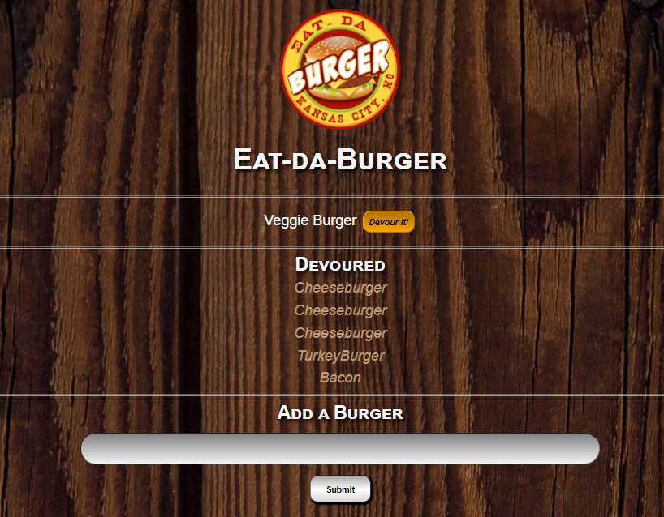

# 🍔 [Eat-Da-Burger](https://github.com/kjhallam/13_burger.git)

## LICENSE


---

## 📓 DESCRIPTION

```

* Eat-Da-Burger! is a restaurant app that lets users input the names of burgers they'd like to eat.  
* Whenever a user submits a burger's name, your app will display the burger on the left side of the page -- waiting to be devoured.  
* Each burger in the waiting area also has a `Devour it!` button. When the user clicks it, the burger will move to the right side of the page.  
* Your app will store every burger in a database, whether devoured or not.

```

---

## 📋 Table of Contents

  1. [DESCRIPTION](#description)
  2. [INSTALLATION](#installation)
  3. [USAGE](#usage)
  4. [CONTRIBUTING](#contributing)
  5. [TEST](#test)
  6. [GITHUB](#github)
  7. [SCREENSHOTS](#screenshots)
  8. [QUESTIONS](#questions)
  
---

## ⬇️ INSTALLATION

Installed npm express, npm express-handlebars, npm mysql, npm init (json-package), npm init -y (json-lock and node_module package)

---

## ⚙️ USAGE

In this assignment, you'll create a burger logger with MySQL, Node, Express, Handlebars and a homemade ORM (yum!). Be sure to follow the MVC design pattern; use Node and MySQL to query and route data in your app, and Handlebars to generate your HTML.

---

## 📓 CONTRIBUTING

None at this time.

---

## 🧪 TEST

N/A

---

## :octocat: GITHUB

[https://github.com/kjhallam](http://github.com/https://github.com/kjhallam)

---

## 📷 SCREENSHOTS



---

## ❔ QUESTIONS

If any questions concerning the use of the markdown file contact me at ✉️ [Email](kjhallam321@gmail.com).
